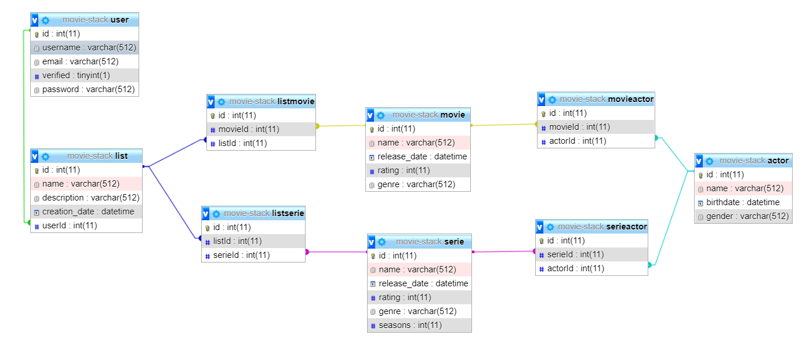

# C2 : Loopback API Movie-Stack

### Home
| |
:---: |

Home Page API LoopBack

### /explorer
| | | | |
:---: | :---: | :---: | :---:
 |  |  | 
ActorController |  ListController | ListMovieController | ListMovieController & ListSerieController | 

| | | | |
:---: | :---: | :---: | :---:
 |  |  | 
ListSerieController | MovieActorController | MovieActorController $ MovieListController | MovieController |

| | | | |
:---: | :---: | :---: | :---:
 |  |  | 
SeriesController | SerieActorController | SerieController | UserListController | 

| |
:---: 
 |
UserController 

### DataBase Relations
| |
:---:
 |
DataBase Relations |

---
[< Previous](c1.md) | [^ Main](https://github.com/movie-stack/report-main/tree/main/docs) | [Next >](c3.md)
:--- | :---: | ---: 
